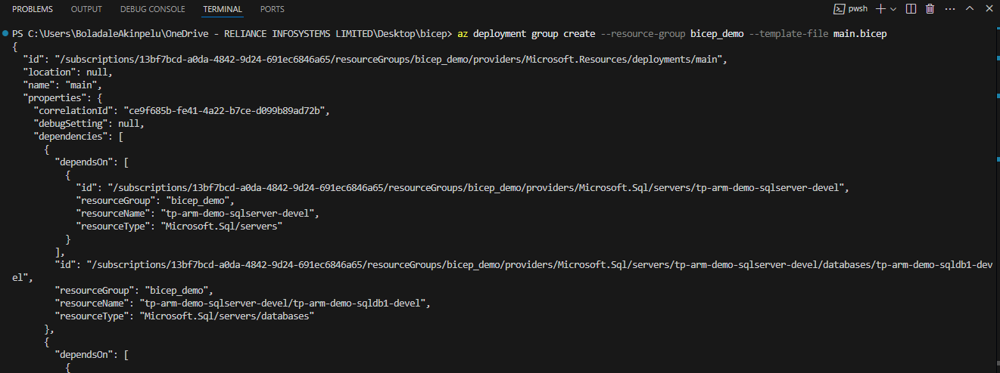
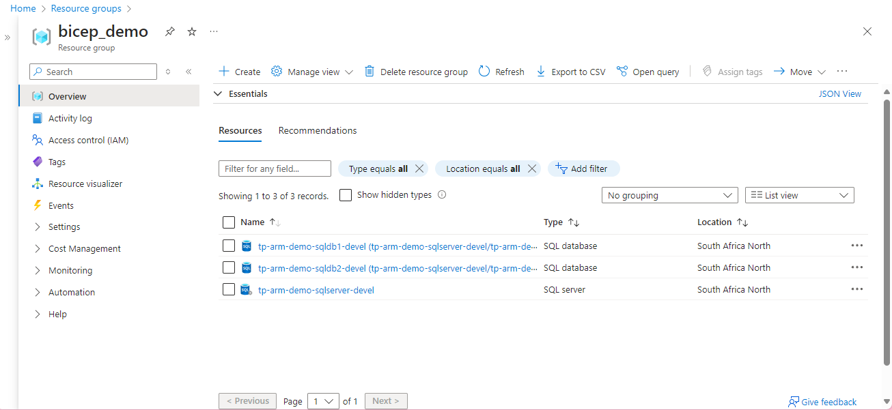

# How to Deploy a sql server and Azure Database(s) using Bicep

Bicep is a domain-specific language (DSL) that uses declarative syntax to deploy Azure resources. It provides concise syntax, reliable type safety, and support for code reuse. Bicep offers the best authoring experience for your infrastructure-as-code solutions in Azure
## Resources
- Overview - https://learn.microsoft.com/en-us/azure/azure-resource-manager/bicep/overview?tabs=bicep
- Set up Bicep - https://learn.microsoft.com/en-us/azure/azure-resource-manager/bicep/install

## Steps
1. Check the Azure CLI version you have

```
az --version
```
[Click here to download Azure CLI if you don't have it](https://learn.microsoft.com/en-us/cli/azure/install-azure-cli-windows?tabs=azure-cli)
2. Check if the version of Bicep you have
```
az bicep version
```
If you do not have Bicep, you need to install it by running this on your powershell

```
az bicep install
```
```
az bicep upgrade
```
3. After installing the dependencies, create a bicep file to deploy a SQL Server and the databases or any resource(s) of your choice(Check the main.bicep in this repo for reference). 
4. After creating the bicep file, run the line below to deploy the resources.
```
az deployment group create --resource-group bicep_demo --template-file main.bicep
```
- I have an existing resource group named "bicep_demo"
- The file name is "main.bicep"

Result


Deployemnt on Azure Portal

